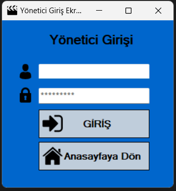

# Sinema-Rezervasyon-Otomasyonu
Yeni rezervasyonların koltuk müsaitliğine göre kontrol ederek uygun olan koltuğu seçerek eklenebilmektedir. Rezervasyon görüntüleme ve düzenleme yapabilirsiniz.
# Uygulamamızın Görsel Düzeni

## Ana Ekran
Ana ekranda Kullanıcı girişi,Yönetici girişi ve Çıkış olarak üç bölümden oluşmaktadır.

## Kullanıcı Girişi
Kullanıcı girişi alanından Kullanıcı adı ve şifersini girerek uygulamaya kullanıcı olarak girebirlirsiniz.
 **Kullanıcı adı**: Admin  
 **Şifre**: 123456 

 

 ## Yönetici Girişi
Yönetici adını ve şifresini girerek uygulamanın yönetin kısmına girebilir.

 
 ## Yönetici Paneli

Yöetici panelinde yeni kulllanıcı eklenebilir veya silinebilir bunun yanı sıra kayıtlı kullanıcıların şifresi değiştirilebilir.
 

 ## Sinema Rezervasyon İşlemleri
 Rezervasyon işlemlerine kullanıcı adı ve şifresini girerek ulaşabilir . Burada boş veya dolu bütün koltuklar gözükür ve dolu olanların üzerinde ise isim yazar.

  

  ### Kayıt İşlemleri Bölümü

  Burada yönetici ve kullanıcı yeni gelen müşterinin adı soyadı  koltuk numarasını ve cinsiyetini yazarak sisteme kaydedebilir.

   

   ### Rezervasyon İptali Bölümü 

   Burada ise rezervasyonu iptal etemek isteyen müşetrinin koltuk numarası yazılarak müşterini rezervasyonu iptal edilir.

 
 
   ### Koltuk Bilgisi

   Sinema salonunda kaç tane boş ve dolu koltuk sayısı olduğunu gösterir.

 

**Bizi ziyaret ettiğiniz için teşekkür ederiz.**
